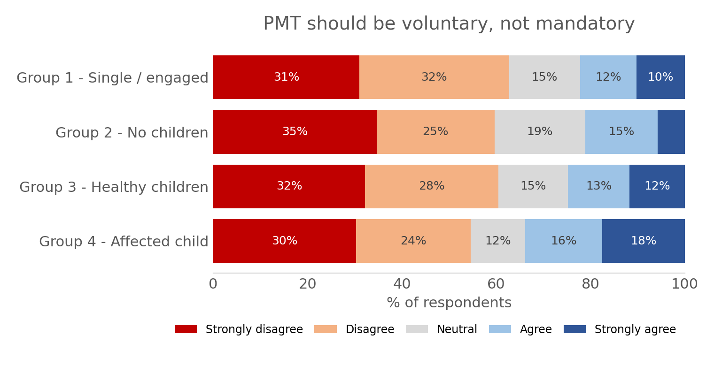
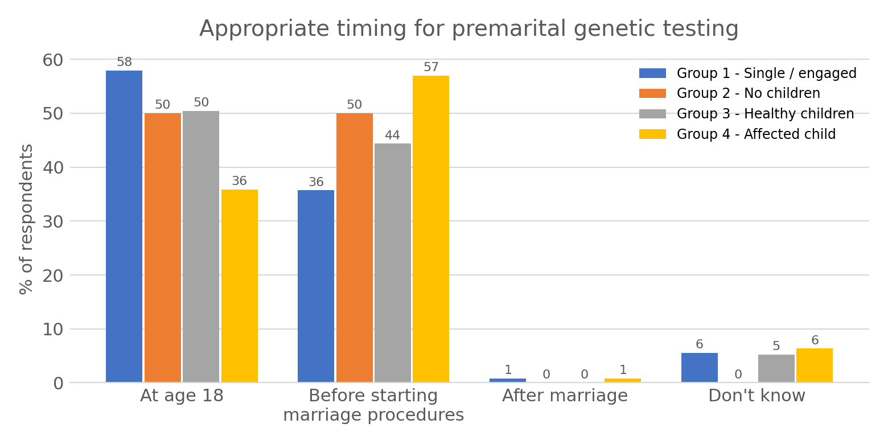
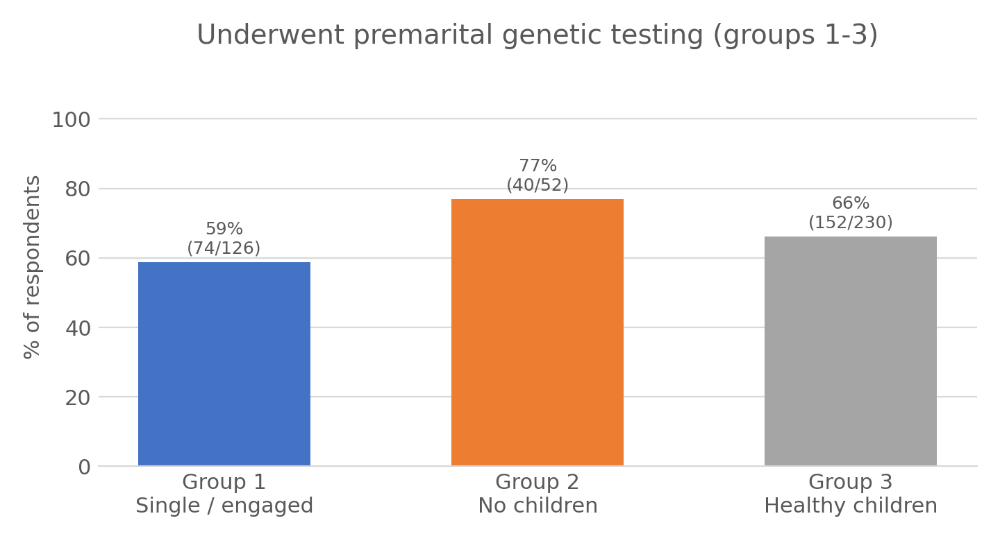
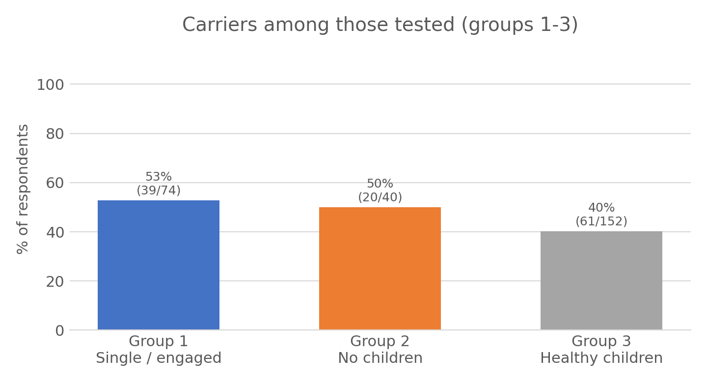

# Awareness of the Existence of Genetic Diagnosis and Premarital Genetic Testing Among Families with Rare Genetic Diseases in Oman

> Are people from families affected by a rare genetic disease aware of premarital genetic testing (PMT), what do they think about it, and do they use it? A survey of 659 respondents in Oman compared across four groups defined by marital and parental status, with a further comparison of carriers and non-carriers.

## Background
Rare genetic disorders can recur in families, and premarital genetic testing is one way to identify carrier couples before marriage. This project analyses a questionnaire completed in Oman by people from families with a diagnosed genetic disease to describe how aware they are of the diagnosis and of PMT, how they view testing, and what they have done in practice.

## Data
- Online Arabic-language questionnaire, responses collected between **December 2022 and January 2023**.
- **659 respondents**: 77% aged 28 or older (16% aged 23-28, 7% aged 18-23); 55% university-educated and 13% postgraduate.
- Respondents fall into four groups:

| Group | Description | n |
|---|---|---|
| 1 | Single or engaged | 126 |
| 2 | Married / divorced / widowed, no children | 52 |
| 3 | Married / divorced / widowed, healthy children | 230 |
| 4 | Married / divorced / widowed, at least one affected child | 251 |

- Topics covered: knowledge (awareness of the diagnosis and of PMT), attitudes (5-point Likert statements), and practice (testing, carrier status, advice given). Carrier status was compared for groups 1-3, because every respondent in group 4 was a carrier.
- The survey data is **not included** in this repository because it contains individual genetic carrier information.

## Methodology
1. Descriptive statistics by group (counts and percentages).
2. Pearson chi-square test for group differences, with **Fisher's exact test** when more than 20% of expected counts were below 5.
3. **Monte Carlo significance** (10,000 sampled tables) when neither test was valid because of sparse tables.
4. Phi and Cramér's V for the strength of association.
5. Likert items scored 1-5 (strongly disagree to strongly agree) and summarised as means with a decision scale (1.00-1.80 very low, 1.81-2.60 low, 2.61-3.40 medium, 3.41-4.20 high, 4.21-5.00 very high).
6. Comparison of carriers and non-carriers within groups 1-3.

## Results

### Knowledge

*Aware of the genetic diagnosis in the family (group 4 was asked about awareness before the first affected child)*

- Awareness of the genetic diagnosis differed strongly between groups (chi-square = 343.0, p < 0.001, Cramér's V = 0.72): 91%, 87%, 79% and 10% in groups 1 to 4.


*Aware that premarital genetic testing exists*

- Awareness of PMT also differed (chi-square = 161.1, p < 0.001, Cramér's V = 0.50): 88%, 80%, 62% and 25%.

### Attitudes
- **PMT as a preventive option:** 83-90% strongly agreed in groups 1-3 and 86% in group 4, with no significant difference between groups.
- **Psychological and social burden of rare genetic disease:** 66%, 83% and 75% of groups 1-3 strongly agreed; the difference was not significant at the 5% level (Monte Carlo p = 0.058, n = 305).


*Should PMT be voluntary rather than mandatory?*

- **Voluntary rather than mandatory:** 55-63% disagreed in every group, and the groups did not differ significantly (chi-square = 13.0, p = 0.37, Cramér's V = 0.08).


*Appropriate timing for PMT*

- **Timing:** more than 92% in every group chose age 18 or before starting marriage procedures; almost nobody chose after marriage.
- **Advice to a couple who are both carriers:** 58-63% would advise consulting a genetic counsellor and 23-30% would advise ending the engagement.

### Practice

*Underwent premarital genetic testing*


*Carrier status among those tested*

- 59%, 77% and 66% of groups 1-3 had been tested; 53%, 50% and 40% of those tested were carriers.

### Carriers versus non-carriers (groups 1-3)

*Mean overall attitude and practice score (1-5); all groups fall in the "high" or "very high" range*


*Carriers: mean agreement per statement*

- Among carriers, only one statement differed significantly across groups: whether their carrier status affected or would cancel a marriage plan (Monte Carlo p = 0.006, Cramér's V = 0.30, moderate). Group 1 agreed most (mean 3.79) compared with group 2 (2.60) and group 3 (2.75).
- Carriers found it easy to tell family, tell a spouse, and encourage a spouse to test (means 4.0-4.6 in all groups).
- Among non-carriers, no statement differed significantly across groups.

## Limitations
- Online convenience sample, so it may not represent all affected families in Oman; answers are self-reported.
- Group sizes are unequal (group 2 has only 52 respondents) and many tables had sparse cells, which is why Monte Carlo tests were needed.
- Several tests were run without a multiple-testing correction.
- Some questions were shown only to subsets of respondents, so denominators differ between items.
- Groups combine marital status and children's health status, so differences cannot be attributed to either factor alone.

## Repository structure
```
├── README.md
├── Chi_square_analysis_report.pdf   # full analysis report with SPSS output
└── images/                          # charts used in this README
```

## Tools
- IBM SPSS Statistics
- Microsoft Word
